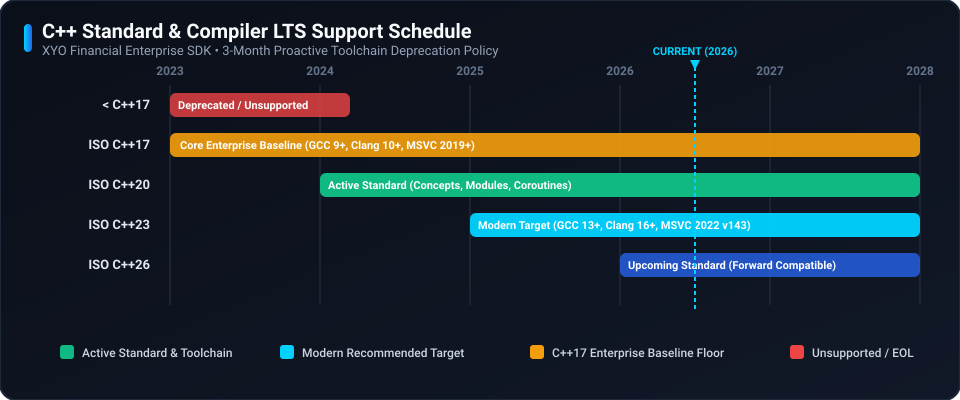

# 🛡️ Security Policy

## 📋 Supported Versions

Only the current major release line of the XYO C++ SDK receives active security updates and patches.

| Version | Supported | End of Security Support |
| ------- | --------- | ----------------------- |
| 2.x     | :white_check_mark: | Active                  |
| < 2.0.0 | :x:                | End of Life (EOL)       |

## ⚙️ Language Standard & Compiler LTS Support Policy

### Policy Guarantee
XYO Financial adheres to strict ISO C++ standards and enterprise compiler toolchain baselines:

- **Minimum Baseline Floor:** We guarantee support for the **ISO C++17** standard on enterprise-grade compilers (**GCC 9+**, **Clang 10+**, **MSVC 2019+ / 2022**, and **Apple Clang 12+**).
- **3-Month Proactive Window:** We will never increase compiler or standard requirements without at least **3 months advance notice** prior to deprecating an older toolchain baseline.

| Standard / Toolchain | Baseline Version | Status | SDK Support Level |
| :--- | :--- | :--- | :--- |
| **ISO C++23** | GCC 13+, Clang 16+, MSVC v143 | :white_check_mark: Modern Target | Fully Compatible |
| **ISO C++20** | GCC 11+, Clang 13+, MSVC v142 | :white_check_mark: Recommended | Fully Compatible |
| **ISO C++17** | GCC 9+, Clang 10+, MSVC 2019 | :lock: Baseline Floor | **Guaranteed Minimum Baseline** |
| **< ISO C++17** | GCC < 9, Clang < 10, MSVC < 2019 | :x: Deprecated | **Unsupported / Incompatible** |

## 🚨 Reporting a Vulnerability

If you discover a potential security vulnerability in this SDK, please do not report it publicly through a GitHub issue. Instead, report it privately:

- **Email:** security@syniol.com
- **Response Time:** We will acknowledge receipt of your vulnerability report within 48 hours and provide a detailed response on next steps within 5 business days.
